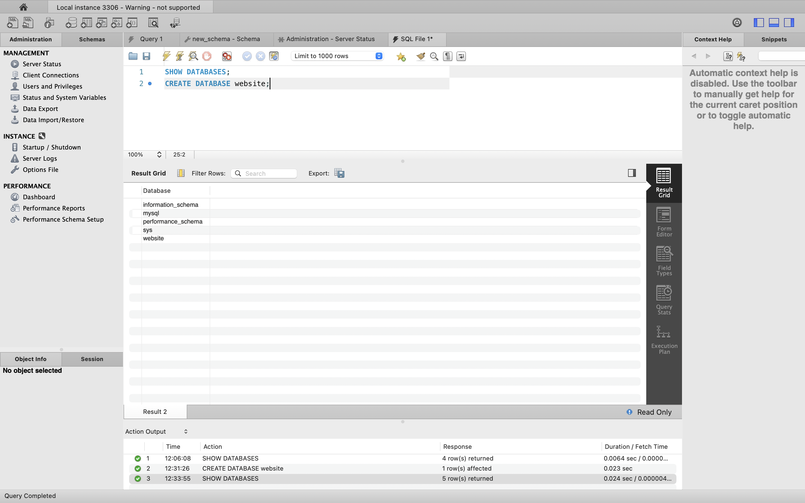
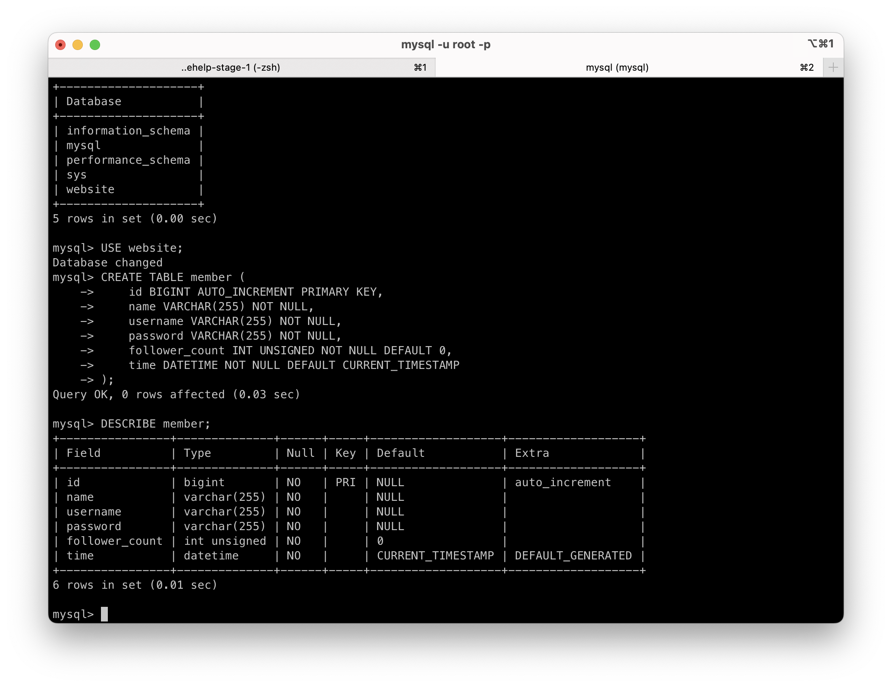
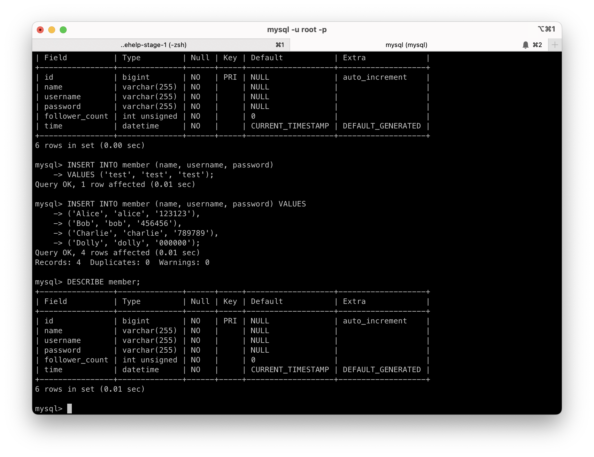
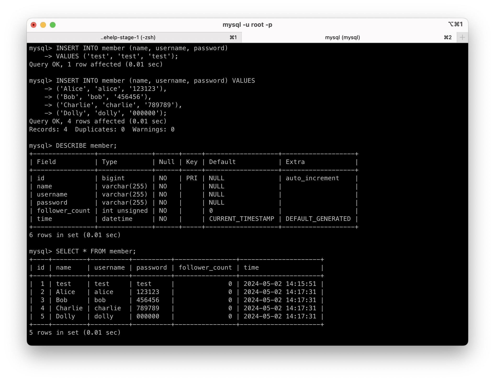
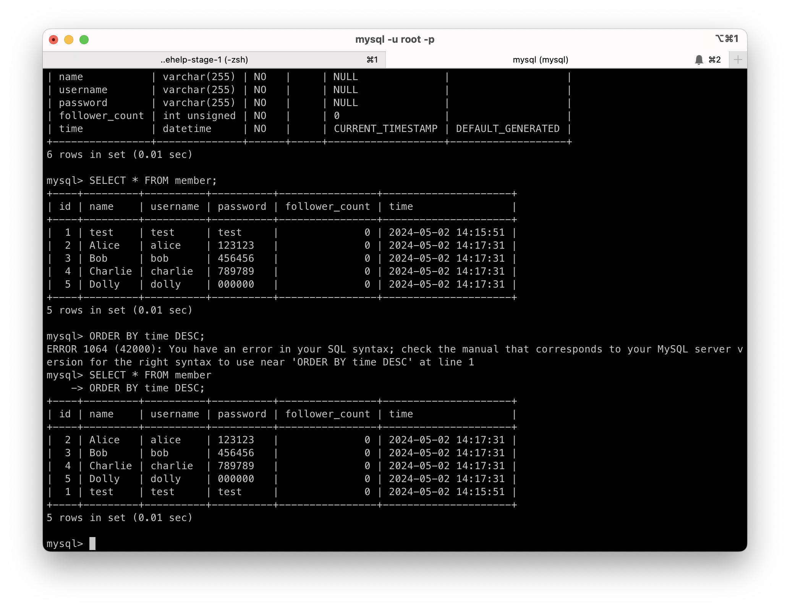
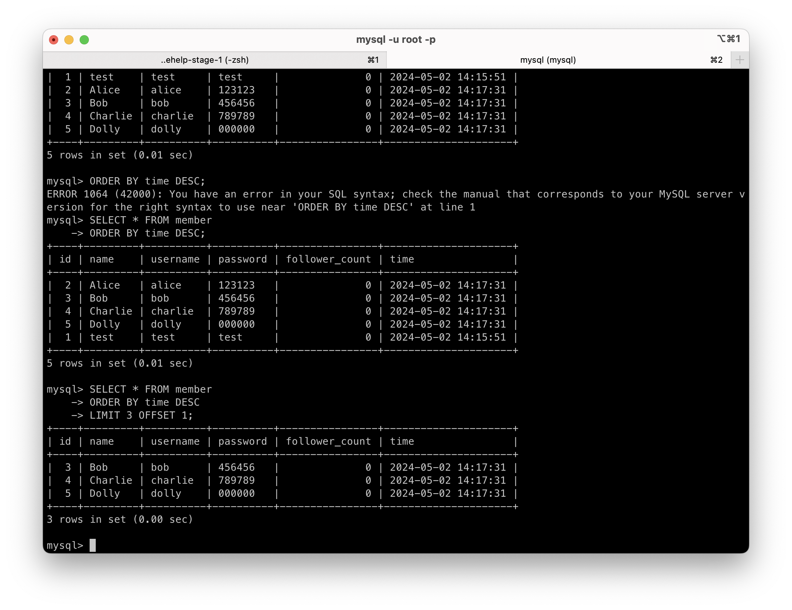
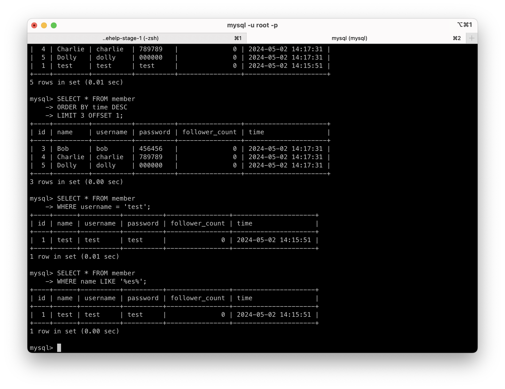
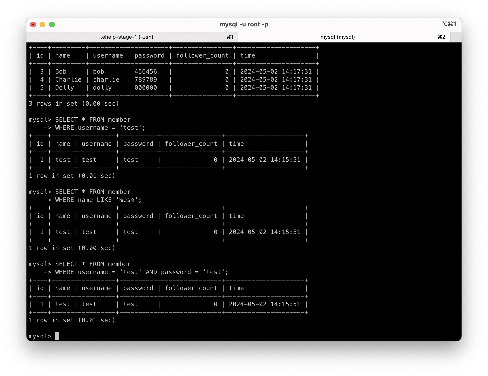
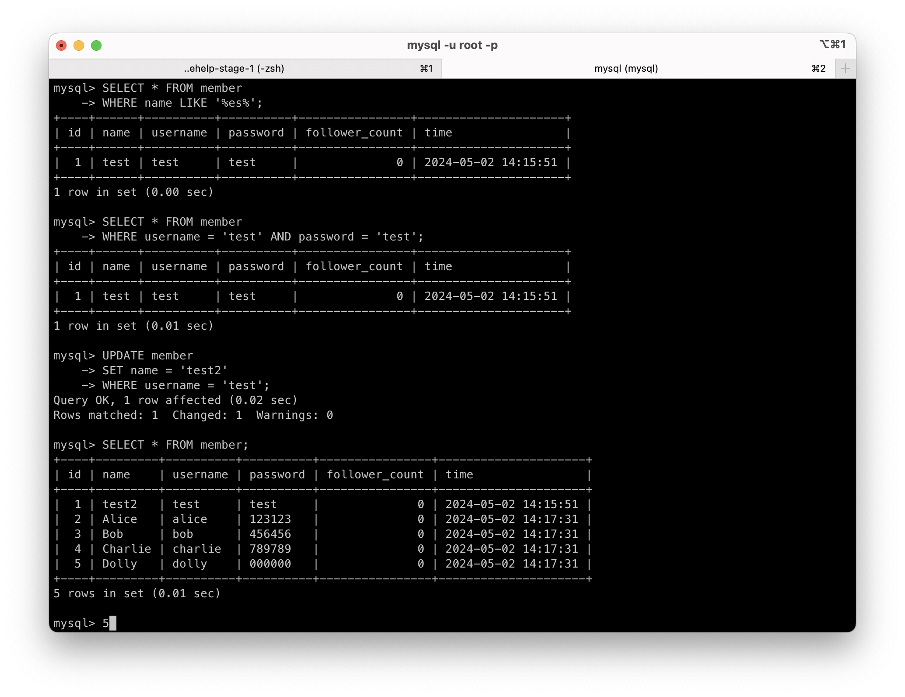

## Week 5

### Task 2

- Create a new database named website.
  

- Create a new table named member, in the website database, designed as below:
  

### Task 3

- INSERT a new row to the member table where name, username and password must be set to test.
  INSERT additional 4 rows with arbitrary data.
  

- SELECT all rows from the member table.
  

- SELECT all rows from the member table, in descending order of time.
  

- SELECT total 3 rows, second to fourth, from the member table, in descending order of time.
  Note: it does not mean SELECT rows where id are 2, 3, or 4.
  

- SELECT rows where username equals to test.
  

- SELECT rows where name includes the es keyword.
  

- SELECT rows where both username and password equal to test.
  

- UPDATE data in name column to test2 where username equals to test
  

### link:
