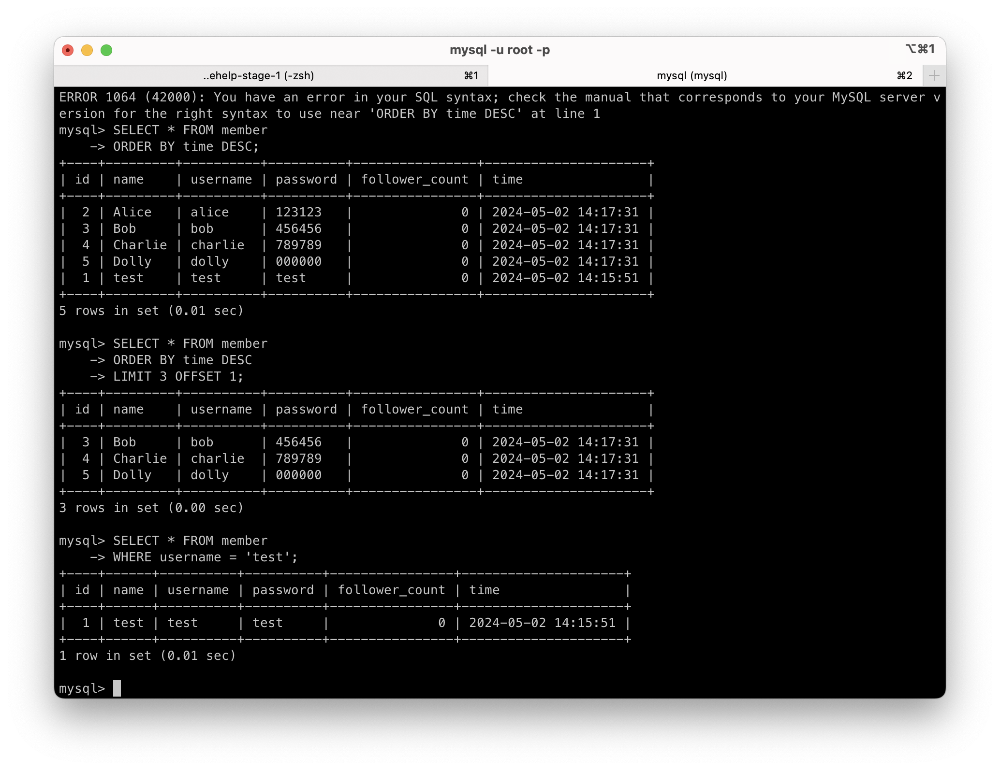

## Week 5

### Task 2

- Create a new database named website.

```sql
CREATE DATABASE website;

```


- Create a new table named member, in the website database, designed as below:

```sql
USE website;

```

```sql
CREATE TABLE member (
    id BIGINT AUTO_INCREMENT PRIMARY KEY,
    name VARCHAR(255) NOT NULL,
    username VARCHAR(255) NOT NULL,
    password VARCHAR(255) NOT NULL,
    follower_count INT UNSIGNED NOT NULL DEFAULT 0,
    time DATETIME NOT NULL DEFAULT CURRENT_TIMESTAMP
);

```


### Task 3

- INSERT a new row to the member table where name, username and password must be set to test.
  INSERT additional 4 rows with arbitrary data.

  ```sql
  INSERT INTO member (name, username, password)
  VALUES ('test', 'test', 'test');
  ```

  ```sql
  INSERT INTO member (name, username, password) VALUES
  ('Alice', 'alice', '123123'),
  ('Bob', 'bob', '456456'),
  ('Charlie', 'charlie', '789789'),
  ('Dolly', 'dolly', '000000');
  ```


- SELECT all rows from the member table.

```sql
SELECT * FROM member;
```


- SELECT all rows from the member table, in descending order of time.

```sql
SELECT * FROM member
ORDER BY time DESC;

```


- SELECT total 3 rows, second to fourth, from the member table, in descending order of time.
  Note: it does not mean SELECT rows where id are 2, 3, or 4.

  ```sql
  SELECT * FROM member
  ORDER BY time DESC
  LIMIT 3 OFFSET 1;

  ```

  

- SELECT rows where username equals to test.

```sql
SELECT * FROM member
WHERE username = 'test';

```



- SELECT rows where name includes the es keyword.

```sql
SELECT * FROM member
WHERE name LIKE '%es%';

```


- SELECT rows where both username and password equal to test.

```sql
SELECT * FROM member
WHERE username = 'test' AND password = 'test';

```


- UPDATE data in name column to test2 where username equals to test.

```sql
UPDATE member
SET name = 'test2'
WHERE username = 'test';
```


### Task 4

- SELECT how many rows from the member table.

```sql
SELECT COUNT(*) FROM member;

```


- SELECT the sum of follower_count of all the rows from the member table.

```sql
SELECT SUM(follower_count) AS TotalFollowers FROM member;
```


- SELECT the average of follower_count of all the rows from the member table.

  - update the 'follower_count'

  ```sql
  UPDATE member
  SET follower_count =
    CASE
        WHEN name = 'test2' THEN 10
        WHEN name = 'Alice' THEN 20
        WHEN name = 'Bob' THEN 30
        WHEN name = 'Charlie' THEN 40
        WHEN name = 'Dolly' THEN 50
    END;

  ```

  - calculate the average

  ```sql
  SELECT AVG(follower_count) AS AverageFollowers FROM member;

  ```

  

- SELECT the average of follower_count of the first 2 rows, in descending order of follower_count, from the member table.

```sql
SELECT AVG(follower_count) AS AverageFollowers
FROM (
    SELECT follower_count
    FROM member
    ORDER BY follower_count DESC
    LIMIT 2
) AS subquery;

```


### Task 5

- Create a new table named message, in the website database. designed as below:

```sql
CREATE TABLE message (
    id BIGINT AUTO_INCREMENT PRIMARY KEY,
    member_id BIGINT NOT NULL,
    content VARCHAR(255) NOT NULL,
    like_count INT UNSIGNED NOT NULL DEFAULT 0,
    time DATETIME NOT NULL DEFAULT CURRENT_TIMESTAMP,
    FOREIGN KEY (member_id) REFERENCES member(id)
);

```


- SELECT all messages, including sender names. We have to JOIN the member table to get that.

  - insert some sample messages into the message table

  ```sql
  INSERT INTO message (member_id, content, like_count, time)
  VALUES
  (1, 'Hello!', 15, '2024-05-02 15:00:00'),
  (2, 'Nice pic!', 25, '2024-05-02 15:05:00'),
  (3, 'How are u doing?', 10, '2024-05-02 15:10:00'),
  (4, 'Good morning, guys!', 15, '2024-05-02 15:15:00'),
  (5, 'Would anyone like to hang out this weekend?', 20, '2024-05-02 15:20:00');

  ```

  - include the sender's names

  ```sql
  SELECT m.id, m.content, m.like_count, m.time, mb.name AS sender_name
  FROM message m
  JOIN member mb ON m.member_id = mb.id;
  ```

  
